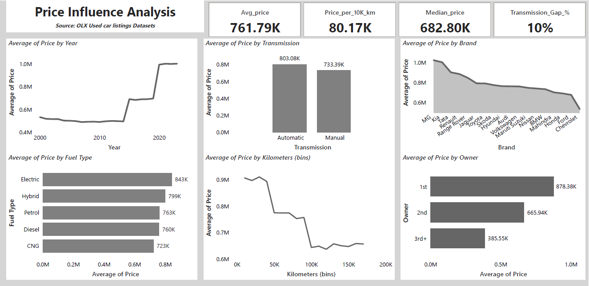

# Used Car Market Analysis

## Project Summary
This project analyzes the Indian used car market using 141,000+ OLX car listings to understand pricing behavior, demand trends, and inventory risk. The analysis was built in Power BI, focusing on business-driven insights rather than only visual dashboards.

The project covers brand performance, price influencers, ownership impact, mileage-based depreciation, fuel and transmission preferences, and inventory concentration. It identifies high-turnover segments such as first-owner hatchbacks and sedans, as well as high-risk inventory including luxury and multi-owner vehicles that move slowly in the resale market.

Key findings show that Maruti Suzuki and Hyundai dominate the market due to affordability and strong resale value. First-owner, petrol, manual cars form the core demand segment, while higher mileage and multiple ownership significantly reduce resale value.

[Click to view Live Dashboard](https://app.powerbi.com/view?r=eyJrIjoiZGJjNjU3OWItN2YzOC00MmQ5LWE5NzktZWRmNWJkZDM1MzI2IiwidCI6IjNmZmZmN2I2LTdlZjQtNGZhNC04ZmVhLTc5OGFiMDQ1NTcxNCJ9)

## Table of Content

1. [Tools & Technologies used](#tools--technologies-used)
2. [Business problem](#business-problem)
3. [Dataset Overview](#dataset-overview)
4. [Brand Analysis](#brand-analysis)
5. [Price Influence Analysis](#price-influence-analysis)
6. [Inventory Optimization Analysis](#inventory-optimization-analysis)
7. [Market Demand & Resale Value Analysis](#market-demand--resale-value-analysis)
8. [Overall Conclusions](#overall-conclusions)
9. [Recommendations](#recommendations)

## Tools & Technologies used

- Data Source: OLX Used Car Listings
- Tool Used: Power BI (Data Modelling, DAX, Visualization), Python(pandas), SQL

## Business Problem

The Indian used car market is highly competitive and price-sensitive. Buyers look for trust, resale value, and affordability, while sellers and platforms need to understand which cars sell faster and which inventory carries higher risk.
This project aims to answer the following business questions:
-	Which brands and car types dominate the used car market?
-	What factors most strongly influence used car prices?
-	Which inventory segments move faster, and which carry higher risk?
-	How ownership, mileage, and fuel type affect resale value?

## Dataset Overview
-	Total listings analysed: 141,000+
-	Average listing price: ₹7.6 Lakhs
-	Average mileage: 95,000 km
-	Electric car share: ~2%
-	Data includes brand, model, fuel type, ownership, mileage, transmission, accidental status, and state.
  
 The dataset represents a realistic marketplace scenario with mixed vehicle conditions and buyer preferences.
 	
[Home](#table-of-content)

## Brand Analysis 

### Key Insights
-	Maruti Suzuki dominates the used car market with the highest number of listings, followed by Hyundai and Honda.
-	These brands have strong presence across Hatchback, Sedan, and SUV segments, indicating wide market acceptance.
-	Hatchbacks form the largest share of inventory, driven mainly by affordability and urban demand.
-	Most cars listed are first-owner vehicles, which increases buyer confidence and resale value.
-	Petrol cars dominate across all major brands, while Diesel and CNG form secondary segments.
-	Manual transmission cars are significantly more common than automatic, reflecting cost-conscious buying behaviour.
-	The majority of listings are non-accidental, improving overall market quality.

[Home](#table-of-content)

## Price Influence Analysis 

### Key Insights
-	Average used car prices have steadily increased since 2015, with a sharp rise after 2020 due to newer models, inflation, and supply constraints.
-	Automatic cars command higher average prices than manual cars, but manual cars dominate in volume.
-	Electric and Hybrid cars show higher average prices, but their overall market presence is still limited.
-	Mileage has a strong negative impact on price. After 60,000–80,000 km, prices drop sharply.
-	First-owner cars command the highest prices, while third-owner cars experience heavy depreciation.
-	The median price is lower than the average price, indicating price skew caused by premium vehicles.

 [Home](#table-of-content)

## Inventory Optimization Analysis 

### Key Insights
-	Hatchbacks represent the largest inventory segment, followed by Sedans and SUVs.
-	SUVs show higher average mileage, suggesting longer ownership cycles before resale.
-	First-owner vehicles dominate inventory across all car types.
-	High-turnover inventory (first-owner hatchbacks and sedans) makes up around 34% of total listings.
-	Low-demand inventory (luxury, MPV, and high-ownership cars) has a very small share but moves slowly.
-	The top 5 brands account for nearly 77% of total inventory, showing high market concentration.

[Home](#table-of-content)

## Market Demand & Resale Value Analysis 

### Key Insights
-	First-owner cars show the strongest demand and highest resale value.
-	Accidental cars have significantly lower average prices, reducing buyer interest.
-	States such as Telangana, Maharashtra, and West Bengal show higher average prices, indicating stronger purchasing power.
-	Mileage combined with ownership has a compounding effect on depreciation.
-	High-risk inventory index is highest for third-owner cars, indicating slower movement and lower demand.

[Home](#table-of-content)

## Overall Conclusions

-	The used car market is volume-driven but value-sensitive.
-	Maruti Suzuki and Hyundai dominate due to trust, affordability, and resale strength.
-	Petrol, manual, first-owner cars form the core demand segment.
-	High mileage and multiple ownership significantly reduce resale value.
-	Inventory concentration is high, but demand is strongest in mass-market vehicles.

[Home](#table-of-content)

## Recommendations

-	Marketplaces should prioritize first-owner hatchbacks and sedans for faster sales.
-	Sellers should price cars based on mileage and ownership, not only brand.
-	Buyers seeking value should focus on second-owner petrol cars with moderate mileage.
-	Electric vehicles need stronger resale demand signals before large-scale inventory expansion.

[Home](#table-of-content)

